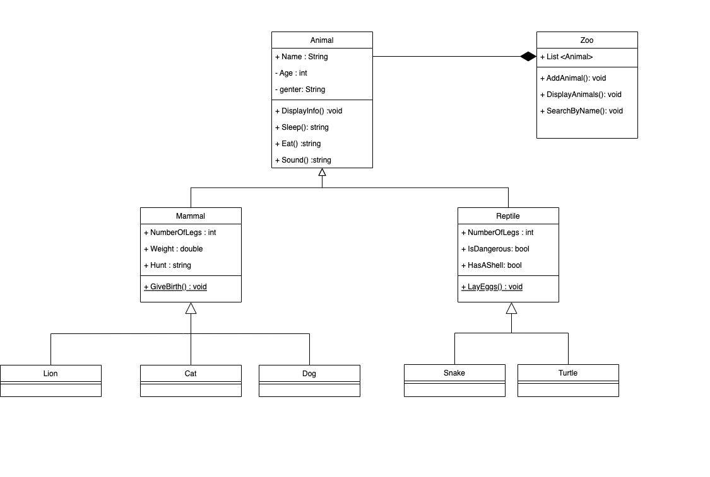
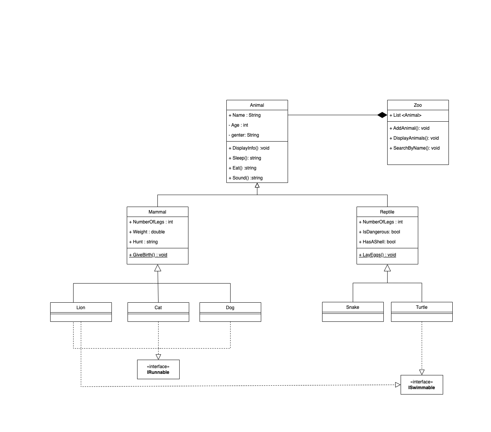

# Lab06-Zoo

## Waht is this project:

This Zoo project is a console application, that applies all OOP principles.
It utilizes an inheritance hierarchy (3 levels of inheritance), with abstract and concrete classes to model different types of animals and their behaviors.
You can check this project if you want an example of the implementation of inheritance, polymorphism, abstraction, encapsulation, and overriding methods.
The project also includes unit tests to ensure the appropriate behaviors are exhibited by each animal class. 

## UML Diagram

## OOP principles:

1- Encapsulation: building data and methods together within a class and controlling their access 

### Example from the project:
encapsulating the properties (such as name, age, and gender) and behaviors (such as eating and sleeping) within the animal classes. 

2- Inheritance: Allows to create of new classes based on existing ones, to share their attributes and methods (Is a relationship)

### Example from the project:
The Mammal and Reptile classes inherit from the Animal class.
Also, Lion, Cat and Dog inherit from Mammal

3- Polymorphism: Allows override methods in the derived classes that share a base class.

### Example from the project:
Each animal type has its own implementation of behaviors like eating, sleeping, and making sounds. However, they can all be treated as Animal objects, allowing for flexibility in working with different animal types.

4- Abstraction: abstract methods are incomplete methods so they should be implemented in the derived classes.

### Example from the project:
The Animal class is an abstract class, It defines abstract methods such as eating and sleeping.
The concrete animal classes like Lion, Cat, and Dog inherit from the Animal class, providing specific implementations.

------------

### What an interface?

Interfaces in C# provide a way to define a contract or a set of related functionalities that a class can implement.

**Interface defines what a class should do without specifying how it should be done.**

### Interfaces in this project:

I have 2 interfaces in this project (ISwimmable, IRunnable), So i implement them in the concrete classes based on which animal is able to run or swim

for example, the cat, lion and dog implements IRunnable.
lion and turtle implements ISwimmable
snake doesn't implement any interface as its not able to swim or run.

## Updated UML Diagram

